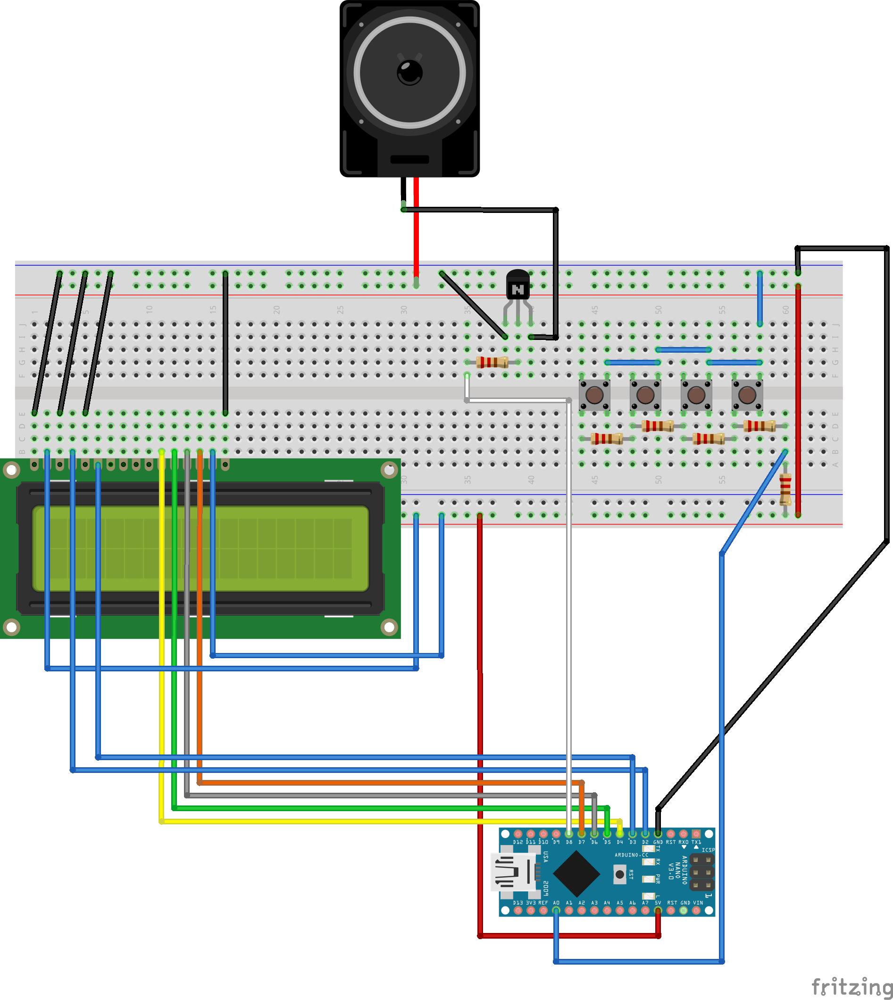
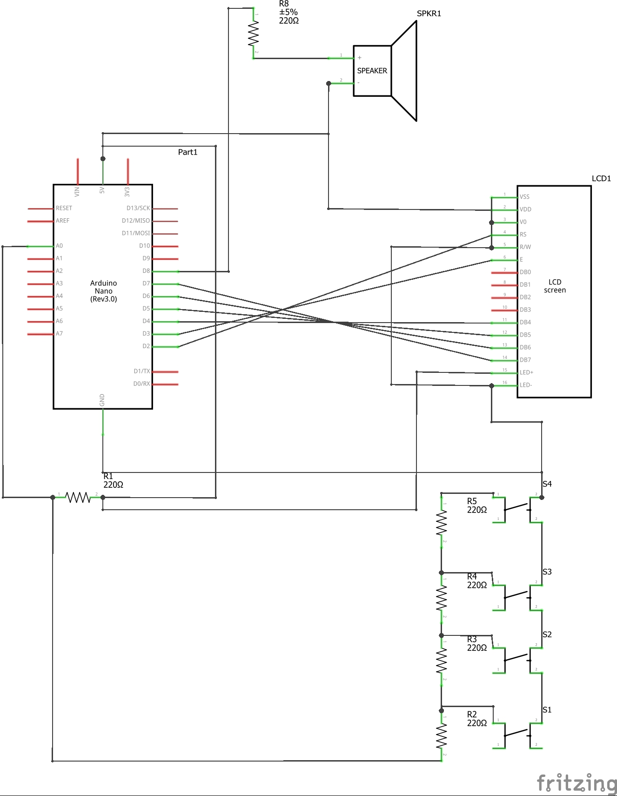

# Microprocessor Systems Project

## Project task and description
#### Required Hardware:
- LCD character display 
- push buttons
- speaker with amplifier
## Requirements
- Generation of sound in range of H – a3 (H- a-a1-a2-a3) with half tones
(a1 = 440Hz)
- Programmable melody consisting from at least 64 notes
- Examples stored in program memory
- Player and composer mode
## Hardware parts
#### Description:
- I use an Arduino buzzer to generate sound. Supplied with 5V. I also use LCD display (HD44780) with 5 analog pushbuttons. They are all on LCD Keypad Shield V3.

  
  

